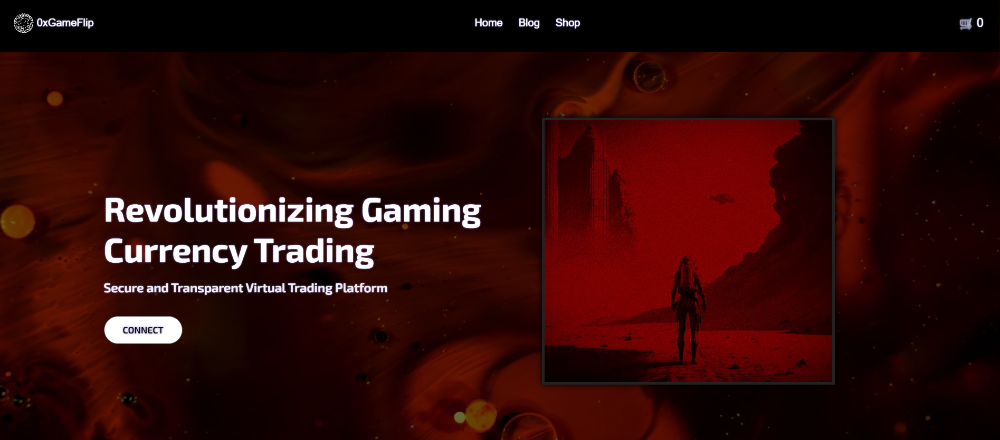
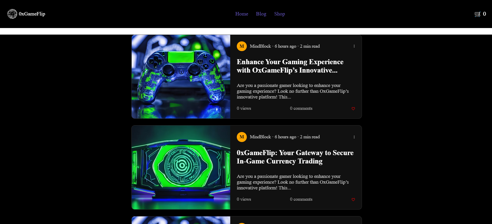

# 🎮 0xGameFlip

0xGameFlip is a blockchain-based platform that enables users to exchange in-game currencies from one game to another. It simplifies the gaming economy by allowing players to collect and transfer currency between different games at a fixed 1:1 exchange rate.

---

## 🌟 Features

- 🔁 *1:1 Currency Exchange Rate*  
  All in-game currencies are exchanged at a 1:1 rate to simplify user experience.

- 🏪 *In-Game Shop*  
  A user-friendly shop interface where users can purchase equipment and accessories for their games.

- 🕹 *Collect Currency Flow*  
  - From the *Home Page, users click the **"Collect"* button.
  - An alert pops up asking for the *Game ID*.
  - After entering the Game ID, users are redirected to the *Transaction Page*.

- 🔄 *Transaction Page*  
  - Users select the two games between which the currency exchange will take place.
  - After confirmation, the currency is transferred using blockchain-based smart contracts.

- 🔐 *Blockchain Integration*  
  All transactions are securely handled using blockchain technology, ensuring transparency and immutability.

---

## 🧰 Tech Stack

- *Frontend*: HTML, CSS, JavaScript
- *Smart Contracts*: Solidity
- *Network*: Ethereum

---

## 📦 Project Structure

